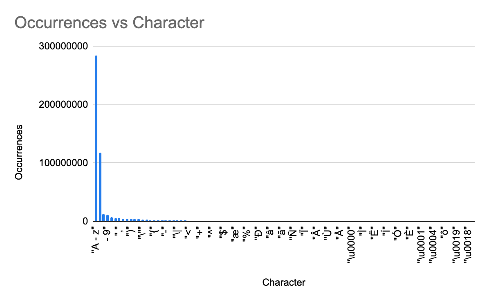
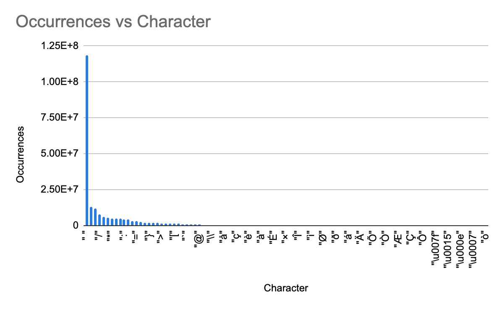
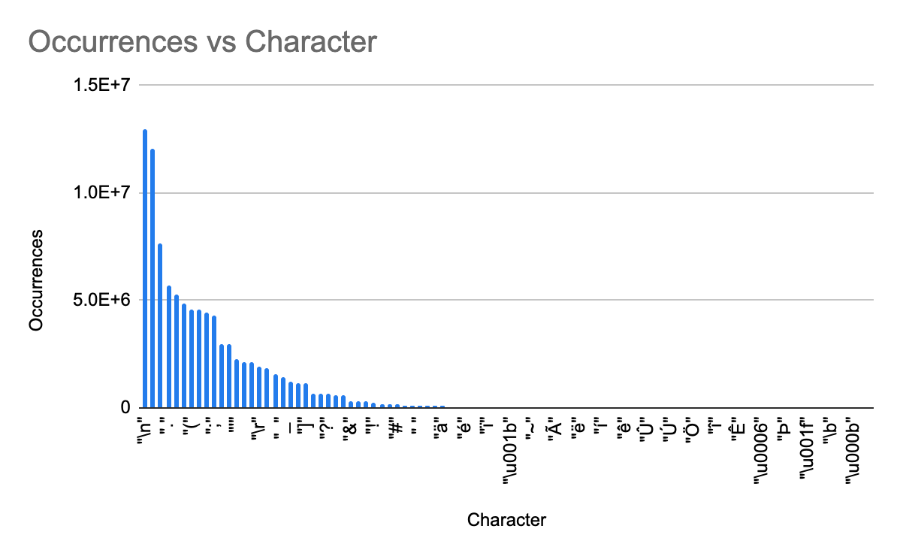

# Frecuency of ASCII characters in Typescript and Javascript code

When building a tokenizer to parse Typescript or Javascript (esbuild, SWC, TSC, etc) consider this finding when writing the `switch` statement cases and their order, the least checks you make the faster ir will be. Not all characters are created equal, a whitespace (100) is more that 1500 times more frecuent than % (37)

## How the character counter works

- It traversers all the folders and subfolders recursively that it founds inside the `data` forlder in the root directory of this repository
- Finds every file but only counts the ones with the following extensions
  - `.ts`
  - `.tsx`
  - `.js"`
  - `.jsx`
  - `.mts`
  - `.mjs`
  - `.cts` 
  - `.cjs`
  - `.d.ts` 
  - `.d.mts`
  - `.d.cts`
- Scans every character (reading the ASCII code) and count the number of occurrences

## Run it yourself

- Create a `data` and inside clone the repositories you want to scan

- Make sure you have go installed, as well node. Also `npm i`

- Run the scripts
npm run start

- Check the results

## Outputs

`output.json`: The key is the ascii code, the value is the number of occurrences.

`stdout`: A table with the escaped names, ascii codes and occurrences. Note that all the letters (a - z, A - Z) and digits (0 - 9) are grouped

`output.csv`: Same as above but in csv format

## Results

The following is an example ouput after running the script with the following repositories in the `data` folder:
  - Angular
  - Vue
  - definitely-typed
  - node
  - react
  - Typescript

| Character | CharCode | Occurrences |
|-----------|----------|-------------|
| "A - z"   | ---      | 283946350   |
| " "       | 32       | 118426366   |
| "\n"      | 10       | 12939620    |
| "0 - 9"   | ---      | 12032791    |
| "/"       | 47       | 7656952     |
| "."       | 46       | 5719973     |
| ","       | 44       | 5261314     |
| "*"       | 42       | 4817435     |
| "("       | 40       | 4596610     |
| ")"       | 41       | 4576496     |
| ":"       | 58       | 4410275     |
| ";"       | 59       | 4259587     |
| "\""      | 34       | 2987244     |
| "="       | 61       | 2972430     |
| "'"       | 39       | 2243891     |
| "{"       | 123      | 2129247     |
| "}"       | 125      | 2127271     |
| "\r"      | 13       | 1913084     |
| "-"       | 45       | 1848648     |
| ">"       | 62       | 1526829     |
| "_"       | 95       | 1382751     |
| "\|"      | 124      | 1185122     |
| "["       | 91       | 1165403     |
| "]"       | 93       | 1143123     |
| "<"       | 60       | 674655      |
| "`"       | 96       | 666969      |
| "?"       | 63       | 615641      |
| "+"       | 43       | 593973      |
| "@"       | 64       | 583870      |
| "&"       | 38       | 317592      |
| "^"       | 94       | 301090      |
| "\\"      | 92       | 273808      |
| "!"       | 33       | 204297      |
| "$"       | 36       | 176215      |
| "å"       | 229      | 166608      |
| "#"       | 35       | 146205      |
| "æ"       | 230      | 109732      |
| "ç"       | 231      | 87046       |
| "	"       | 9        | 79940       |
| "%"       | 37       | 74606       |
| "è"       | 232      | 73751       |
| "ä"       | 228      | 53278       |
| "Ð"       | 208      | 42002       |
| "à"       | 224      | 38155       |
| "é"       | 233      | 37039       |
| "â"       | 226      | 30489       |
| "É"       | 201      | 28294       |
| "ï"       | 239      | 28069       |
| "ã"       | 227      | 25070       |
| "×"       | 215      | 20241       |
| "\u001b"  | 27       | 20113       |
| "Ñ"       | 209      | 17768       |
| "Î"       | 206      | 17690       |
| "~"       | 126      | 13372       |
| "Ï"       | 207      | 8630        |
| "ì"       | 236      | 8361        |
| "Ã"       | 195      | 8231        |
| "Â"       | 194      | 7939        |
| "Ø"       | 216      | 6893        |
| "ë"       | 235      | 5871        |
| "Ù"       | 217      | 4212        |
| "ð"       | 240      | 4032        |
| "í"       | 237      | 2765        |
| "Å"       | 197      | 2620        |
| "á"       | 225      | 2444        |
| "ê"       | 234      | 2276        |
| "\u0000"  | 0        | 1674        |
| "Ä"       | 196      | 1223        |
| "Û"       | 219      | 1168        |
| "Ì"       | 204      | 752         |
| "Õ"       | 213      | 476         |
| "Ú"       | 218      | 436         |
| "Ë"       | 203      | 294         |
| "Ò"       | 210      | 250         |
| "Ö"       | 214      | 205         |
| "Í"       | 205      | 190         |
| "Æ"       | 198      | 166         |
| "î"       | 238      | 136         |
| "Ó"       | 211      | 113         |
| "Ç"       | 199      | 98          |
| "Ê"       | 202      | 88          |
| "È"       | 200      | 77          |
| "Ô"       | 212      | 74          |
| "\u0006"  | 6        | 70          |
| "\u0001"  | 1        | 41          |
| "\u007f"  | 127      | 20          |
| "Þ"       | 222      | 19          |
| "\u0004"  | 4        | 10          |
| "\u0015"  | 21       | 10          |
| "\u001f"  | 31       | 10          |
| "ô"       | 244      | 4           |
| "\u000e"  | 14       | 3           |
| "\b"      | 8        | 2           |
| "\u0019"  | 25       | 2           |
| "\u0007"  | 7        | 1           |
| "\u000b"  | 11       | 1           |
| "\u0018"  | 24       | 1           |
| "ò"       | 242      | 1           |

_Table generated with [this website](https://tableconvert.com/json-to-markdown)_

### Charts

#### All characters

#### Without letters and digits

#### Without letters and digits and whitespaces
